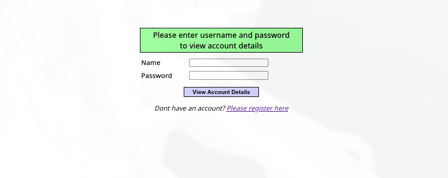
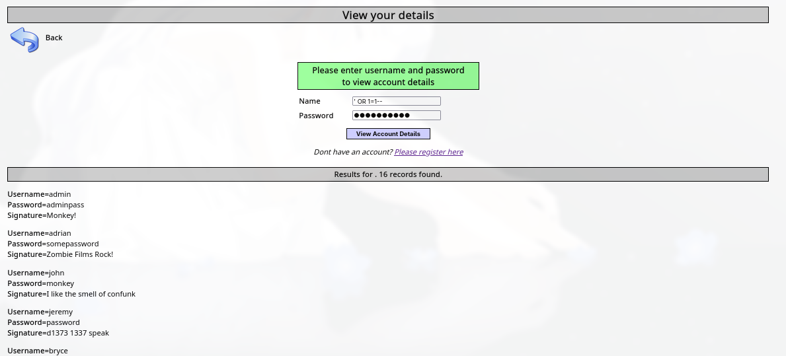
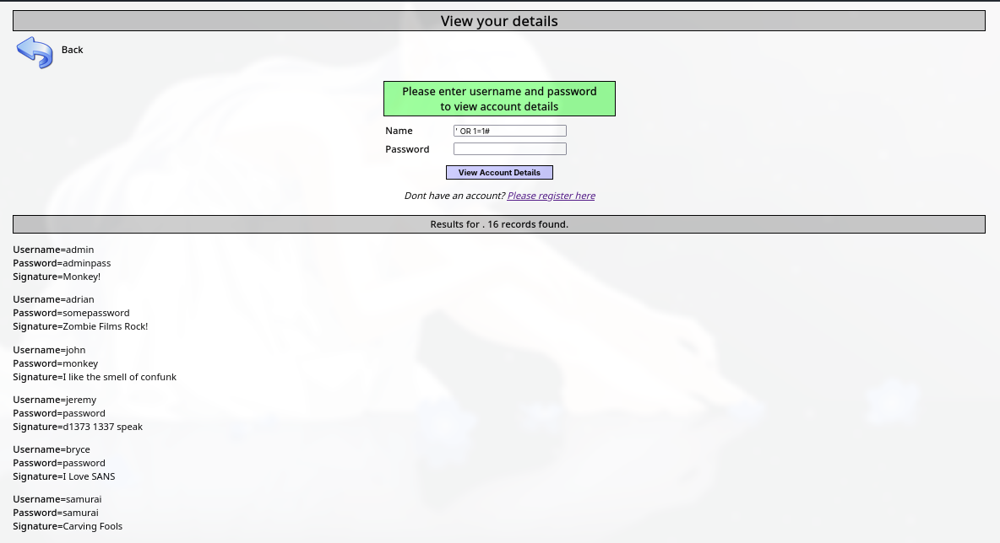
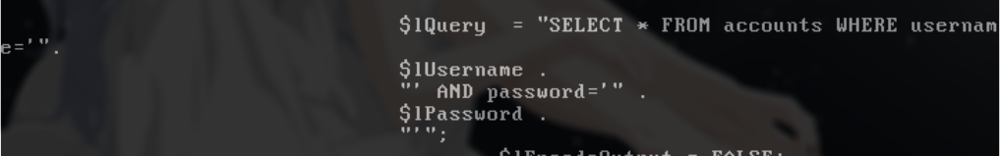

# Introdução

Estarei iniciando postagens sobre os desafios existentes do Metasploitable 2 na aba do Mutillidae para fins de aprendizado e compartilhamento de conhecimento. Espero que gostem!

## OWASP top 10 (2017)

O OWASP é um documento de referência sobre vulnerabilidades em aplicações web com o intuito de conscientização para desenvolvedores.
Representando os riscos mais críticos para aplicações web.

# A1 - Injection SQLI

## Impactos

SQLI (SQL INJECTION) é uma vulnerabilidade em que um atacante interfere no banco de dados, conseguindo realizar consultas nas quais a aplicação consulta no banco de dados. Essa vulnerabilidade permite que o atacante consiga ver e manipule os dados armazenados no banco de dados.
Também é possível que o atacante consiga executar comandos do sistema alterando a instrução SQL para redirecionar a saída para um arquivo e ser executado.
A vulnerabilidade SQL pode ocorrer em qualquer parte dentro da consulta. 

## Obtendo dados ocultos

Por exemplo, um site que exibe os produtos em diferentes categorias, quando o usuário clica na categoria gifts.
```
https://insecure-website.com/products?category=Gifts
```

A aplicação está fazendo uma consulta ao banco de dados para pegar as informações necessárias dos produtos:

```SQL
SELECT * FROM Products WHERE category = "Gifts" AND released = 1
```

O "released = 1" significa que está consultando os produtos que contêm o campo released igual a um. Vamos supor que o restante dos produtos não consultados tenha o campo "released" em outras numerações.
Essa maneira de realizar uma consulta não é segura contra injeções SQL. O atacante pode ignorar o filtro "release":
```
https://insecure-website.com/products?category=Gifts' --
```

Os caracteres "--" são comentários em SQL, possibilitando que tudo após os dois traços seja apenas um comentário, assim conseguimos todos os produtos independentemente da numeração do "release" fazendo com que a consulta SQL fique dessa maneira:

```SQL
SELECT * FROM Products WHERE category = 'Gifts' --' AND released == 1
```

Podemos utilizar um ataque parecido que irá causar que a aplicação mostre todos os produtos, independentemente da categoria.

```
https://insecure-website.com/products?category=Gifts'+OR+1=1--
```

Na consulta SQL ficaria:

```SQL
SELECT * FROM Products WHERE category = 'Gifts' OR 1=1--' AND release = 1
```

Essa consulta irá retornar todos os produtos cuja categoria é 'Gifts' ou 1 é igual a um, mas, como 1=1 é sempre verdadeiro, retornará todos os itens.
# Replicando no metasploitable

Agora que sabemos como funciona a vulnerabilidade, vamos replicá-la em um ambiente controlado.  
Estarei replicando no Metasploitable 2.

Ao entrar no desafio temos um tela de Login comum:



Podemos observar que possui dois campos de entrada; será que é vulnerável a SQLI?
Vamos tentar utilizar a condição "'OR 1=1--"
Conseguimos todos os usuários e senhas, porém, aparentemente, o SQL não considerou o restante da consulta em comentário, sendo necessário colocar a condição OR em ambos os campos:
```SQL
SELECT * FROM accounts WHERE username='' OR 1=1-- AND password='' OR 1=1--
```



Entretanto, o banco de dados utilizado pela aplicação pode não possuir suporte para esse tipo de comentários ("--"). Também é possível utilizar "#" ou "/* */". É dependente de qual banco de dados esta sendo utilizado.
```SQL
'OR 1=1#
```
Assim o banco de dados ignorará o restande do conteúdo após o "#"
```SQL
SELECT * FROM accounts WHERE username='' OR 1=1# AND password=''
```


## Analisando código fonte



Podemos ver que a entrada de dados não é tratada da forma correta, permitindo que o atacante realize consultas que ignorem o filtro de senha e usuário.

## Possíveis medidas

Para consertar essa vulnerabilidade, podemos utilizar declarações preparadas em vez de realizar concatenação de string na consulta.
Este código é vulnerável porque a entrada do usuário é concatenada diretamente na consulta SQL.

```SQL
String query = "SELECT * FROM accounts WHERE username = '"+ entrada_do_usuário + "'";
```
Para:

```SQL
PreparedStatement statement = connection.prepareStatement("SELECT * FROM accounts WHERE username = ?");
```
Para a declaração preparada ser eficaz, a string utilizada para consulta deve ser sempre uma constante codificada.

### Conclusão

É de muita importância tratar com cuidado as entradas de usuário, porque uma entrada mal higienizada pode levar à execução de comandos indesejados na aplicação.

## Referência:

Portswigger: https://portswigger.net/web-security/sql-injection

Owasp top 10: https://github.com/OWASP/Top10/blob/master/2017%2FOWASP%20Top%2010-2017%20%28en%29.pdf

CWE mitre: https://cwe.mitre.org/data/definitions/89.html

Metasploitable: https://docs.rapid7.com/metasploit/metasploitable-2/

Projeto top 10: https://owasp.org/projects/top-ten

Php manual: https://www.php.net/manual/en/language.basic-syntax.comments.php
